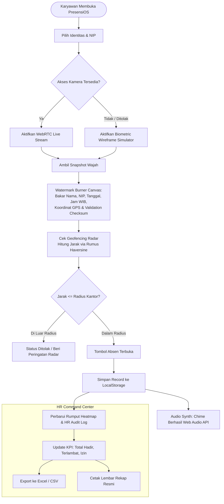

# 💠 PresensiOS (HadirKu Enterprise)

<p align="center">
  
  
  
  
  
  
</p>

<p align="center">
  🌐 <strong>Live Demo Langsung (Tanpa Install):</strong><br>
  👉 <a href="https://olyxmintabansos-byte.github.io/presensios/" target="_blank"><strong>https://olyxmintabansos-byte.github.io/presensios/</strong></a>
</p>

---

> **Sistem Presensi & Absensi Karyawan/Siswa Digital Modern — Anti-AI Slop, Local-First, Zero Backend, dan 100% Client-Side.**

Sebagian besar aplikasi absensi di internet mengandalkan arsitektur usang (*PHP Native, stack XAMPP, database MySQL berat, atau styling Bootstrap 3/4*) yang memerlukan setup server rumit hanya untuk pengujian. 

**PresensiOS** membalik paradigma tersebut: menghadirkan fungsionalitas presensi korporat kelas enterprise (*live biometric camera, geofencing radar dengan rumus Haversine, attendance heatmap ala GitHub, dual-perspective switch, hingga export audit CSV*) murni di sisi browser pengguna tanpa backend, tanpa API pihak ketiga berbayar, dan tanpa dependensi framework yang berat.

---

## 📑 Daftar Isi

- [Demo & Tampilan](#-demo--tampilan)
- [Diagram Alur Sistem](#-diagram-alur-sistem)
- [Fitur Utama](#-fitur-utama)
- [Teknologi & Arsitektur](#-teknologi--arsitektur)
- [Struktur Folder](#-struktur-folder)
- [Panduan Penggunaan & Simulasi](#-panduan-penggunaan--simulasi)
- [Cara Menjalankan Secara Lokal](#-cara-menjalankan-secara-lokal)
- [Tabel Kompatibilitas Browser](#-tabel-kompatibilitas-browser)
- [Lisensi & Pembuat](#-lisensi--pembuat)

---

## 🌟 Demo & Tampilan

Aplikasi ini dapat diakses langsung melalui perangkat apa saja (Smartphone Android/iOS, Tablet, Laptop, atau PC Kantor):
* **URL GitHub Pages:** [https://olyxmintabansos-byte.github.io/presensios/](https://olyxmintabansos-byte.github.io/presensios/)
* **Dual View:**
  * 👤 **Mode Kiosk:** Didesain untuk karyawan melakukan verifikasi wajah, cek radius radar, dan presensi masuk/pulang/izin.
  * 🛡️ **Mode HR Command Center:** Dashboard metrik real-time untuk HR/Admin, tabel audit, filter divisi, modal inspeksi biometrik, dan cetak rekap data.

---

## 🔄 Diagram Alur Sistem

Berikut adalah alur verifikasi data dan pengolahan presensi di PresensiOS:



---

## ✨ Fitur Unggulan

### 1. 📸 Live Biometric Camera & Canvas Watermark Burner
- **Real WebRTC Stream:** Menggunakan `navigator.mediaDevices.getUserMedia` dengan target rasio video ideal.
- **Biometric Oval Frame & Laser Scan:** Animasi laser pemindaian futuristik untuk memastikan posisi wajah presisi di tengah bingkai.
- **Biometric Fallback Simulator:** Jika webcam dinonaktifkan atau peramban tidak memiliki izin kamera, sistem secara otomatis merender wireframe wajah biometrik kanvas interaktif berpartikel agar pengguna tetap dapat menguji fungsionalitas secara utuh.
- **Permanent Watermark Burning:** Snapshot kanvas langsung membakar metadata anti-tamper (Nama Karyawan, NIP, Tanggal ISO, Waktu WIB presisi detik, Koordinat Latitude/Longitude, dan Verification Checksum).

### 2. 📍 Smart Geofencing Radar (Haversine Formula)
- Menghitung jarak geodesic lengkung bumi antara koordinat pengguna dan titik presensi pusat (*Default: Graha Mandiri / Menara Graha Jakarta: Lat -6.2088, Lon 106.8456*) menggunakan rumus:
  $$\Delta\sigma = 2 \arcsin \left( \sqrt{\sin^2\left(\frac{\Delta\phi}{2}\right) + \cos(\phi_1)\cos(\phi_2)\sin^2\left(\frac{\Delta\lambda}{2}\right)} \right)$$
  $$d = R \cdot \Delta\sigma$$
- **Radar Visualizer:** Animasi sweep sapuan radar 360° dengan titik ping berkedip dinamis.
- **Interactive Quick Simulators:** Tersedia tombol `[ 📍 Simulasikan Di Kantor (0m) ]` dan `[ 🏖️ Simulasikan Luar Radius (750m) ]` untuk mempermudah demonstrasi dan review tanpa harus berpindah lokasi fisik.

### 3. ⏱️ Deteksi Shift & Keterlambatan Otomatis
- Jam target masuk kerja: **08:00 WIB**.
- Jam Masuk $\le$ 08:00 WIB $\rightarrow$ **Tepat Waktu** (*Emerald Badge*).
- Jam Masuk $>$ 08:00 WIB $\rightarrow$ **Terlambat** (*Amber Badge* dengan kalkulasi denda menit keterlambatan).
- Mode absensi lengkap: **Masuk**, **Pulang** (menghitung durasi jam kerja kumulatif), dan **Izin / Cuti** (Sakit dengan nomor surat, Cuti Tahunan, Izin Mendesak, Dinas Luar).

### 4. 🟩 Rumput Kehadiran (Attendance Heatmap Streak)
- Grid kehadiran visual 30 hari bergaya **GitHub Contribution Graph**.
- Setiap cell merefleksikan status kehadiran (Hadir Tepat Waktu, Terlambat, Izin, Libur) dengan tooltip interaktif saat di-hover.

### 5. 🛡️ HR Command Center & Audit Trail
- **4 Real-Time KPI Cards:** Tingkat Kehadiran (%), Total Hadir, Terlambat, dan Izin/Cuti.
- **Live Search & Filter:** Pencarian instan berdasarkan Nama atau NIP, filter dropdown divisi (*IT Engineering, Finance, Creative, Operations*).
- **Inspection Modal:** Klik thumbnail foto wajah pada tabel untuk membuka modal detail foto beresolusi penuh lengkap dengan metadata validasi.
- **One-Click Export to CSV:** Mengunduh seluruh rekap log ke format CSV yang kompatibel langsung dengan Microsoft Excel (menggunakan UTF-8 BOM).
- **Print Ready:** Dilengkapi stylesheet `@media print` khusus untuk mencetak laporan resmi tanpa tombol-tombol UI.

### 6. 🔊 Web Audio API Synthesizer (Zero Audio Assets)
- Tidak membutuhkan file `.mp3` atau `.wav` eksternal yang lambat dimuat.
- Efek suara kamera shutter, radar beep, chime sukses (notasi chord C-Major), dan nada error di-generate secara real-time via oscillator web audio murni.

---

## 🛠️ Teknologi & Arsitektur

| Layer | Teknologi | Peran |
|---|---|---|
| **Core UI** | HTML5 Semantic | Struktur aplikasi modern SPA, modal dialog, layout grid |
| **Styling** | Modern CSS3 (Variables, Flexbox, CSS Grid) | Dark Slate Palette (`#0B0F17`, `#111827`, `#1F2937`), Glassmorphism, Responsive Mobile |
| **Logic** | Vanilla JavaScript (ES6+) | Manajemen State, Event Handling, Rumus Haversine, Manipulasi Canvas |
| **Biometric** | HTML5 Canvas & WebRTC API | Stream kamera webcam, capture foto, pembakaran watermark permanen |
| **Database** | Browser `localStorage` | Penyimpanan persisten client-side bebas latency dengan mock data awal |
| **Sound** | Web Audio API | Sintesis frekuensi audio realtime (Sine & Triangle oscillators) |

---

## 📁 Struktur Folder

```text
presensios/
├── index.html        # Single-page application structure & template modal
├── style.css         # Styling modern dark slate, animasi radar & responsive layout
├── script.js         # Engine presensi, logika geofencing, WebRTC, audio synth & HR log
└── README.md         # Dokumentasi resmi proyek
```

---

## 🕹️ Panduan Penggunaan & Simulasi

1. **Memilih Karyawan:** Pilih profil karyawan pada dropdown (*misal: Aditya Pratama - IT Engineering*).
2. **Snapshot Wajah:**
   - Klik **"📸 Ambil Snapshot Wajah"**.
   - Kamera akan mengambil gambar dan kanvas akan membakar identitas serta koordinat saat itu.
3. **Mengatur Lokasi Demo:**
   - Klik **"📍 Di Kantor (0m)"** untuk menyimulasikan posisi tepat di kantor.
   - Atau klik **"🏖️ Luar Radius (750m)"** untuk menguji sistem penolakan geofencing.
4. **Kirim Presensi:** Klik tombol **"📥 Absen Masuk Sekarang"** atau **"📤 Absen Pulang"**.
5. **Buka HR Center:** Klik tombol tab **"🛡️ HR Command Center"** di kanan atas untuk memantau data yang baru saja masuk ke tabel audit.

---

## 🚀 Cara Menjalankan Secara Lokal

Aplikasi ini tidak memerlukan instalasi runtime Node.js, PHP, Apache, ataupun Docker.

### Opsi 1: Buka Langsung di Browser
1. Clone repositori ini:
   ```bash
   git clone https://github.com/olyxmintabansos-byte/presensios.git
   cd presensios
   ```
2. Klik ganda file `index.html` atau buka dengan browser kesayangan Anda.

### Opsi 2: Menggunakan Live Server (VS Code / Python)
Untuk menguji fitur kamera WebRTC secara optimal tanpa batasan protokol lokal:
```bash
# Menggunakan Python built-in server:
python -m http.server 3000

# Atau menggunakan npx serve:
npx serve .
```
Buka browser pada alamat `http://localhost:3000`.

---

## 🌐 Tabel Kompatibilitas Browser

| Fitur | Chrome / Edge | Safari (iOS / Mac) | Firefox | Opera |
|---|:---:|:---:|:---:|:---:|
| WebRTC Camera (`getUserMedia`) | ✅ Didukung | ✅ Didukung (iOS 14.3+) | ✅ Didukung | ✅ Didukung |
| Canvas Watermark Burning | ✅ Didukung | ✅ Didukung | ✅ Didukung | ✅ Didukung |
| Geolocation API | ✅ Didukung | ✅ Didukung | ✅ Didukung | ✅ Didukung |
| Web Audio API Synth | ✅ Didukung | ✅ Didukung | ✅ Didukung | ✅ Didukung |
| LocalStorage Persistence | ✅ Didukung | ✅ Didukung | ✅ Didukung | ✅ Didukung |

---

## 📄 Lisensi & Pembuat

Dibuat dengan dedikasi penuh oleh **Olyx** ([@olyxmintabansos-byte](https://github.com/olyxmintabansos-byte)).  
Dirilis di bawah naungan **[Lisensi MIT](https://opensource.org/licenses/MIT)** — bebas digunakan, dikembangkan, dan dimodifikasi untuk keperluan edukasi, komersial, maupun portofolio.
